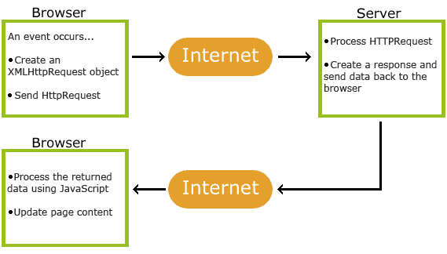
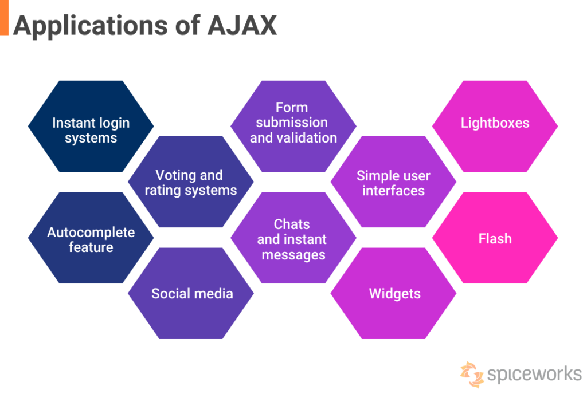

## **Ajax**

- Presented by:
  - SUIRITA Fahd
- Framed by:
  - ESSARRAJ Fouad

---

### **1. Introduction**

---

### **2. How Ajax Works:**

---

### **3. Key Methods and APIs:**

---

### **4. Example Use Case:**

---

### **6. Live Coding:**

---

### **7. Conclusion:**
